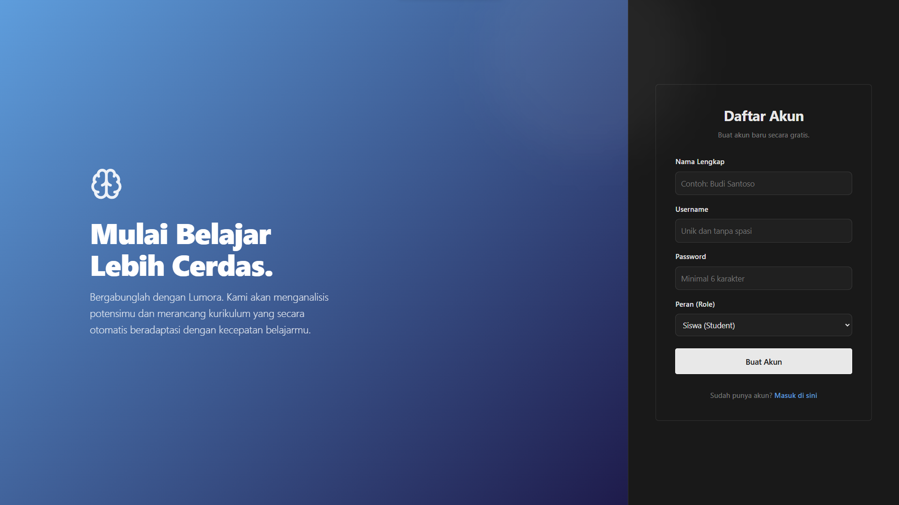
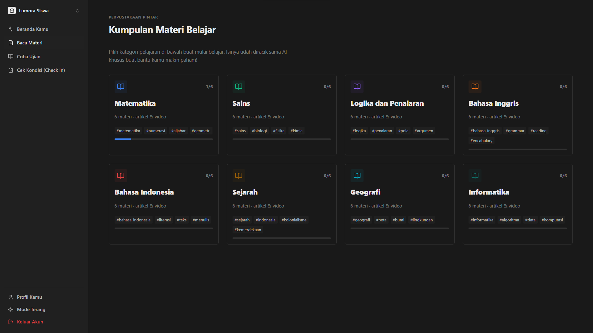

<div align="center">

# Lumora - Aplikasi Pembelajaran Berbasis AI


</div>

Lumora adalah aplikasi web pembelajaran adaptif yang memadukan modul materi edukasi dengan pemodelan *Machine Learning*. Aplikasi ini dibuat sebagai mahakarya akhir (*Capstone Project*) dari program **Pijak in collaboration with IBM SkillsBuild** yang diselenggarakan oleh **Dicoding**.

Berbeda dengan aplikasi e-learning statis, Lumora mencatat rekam jejak psikologis harian siswa (seperti jam tidur dan tingkat stres) beserta riwayat nilai mereka, lalu menggunakan model prediksi (Random Forest) untuk menyusun rekomendasi belajar secara otomatis.

---

## 📸 Tangkapan Layar Aplikasi

<div align="center">
  
  
  
  
</div>

---

## 🚀 Live Demo

- **Aplikasi Web**: [Kunjungi Lumora di Vercel](https://pijak-capstone-lumora.vercel.app)
*(Catatan: Karena Backend API di Render.com akan 'tidur' jika tidak ada aktivitas, proses masuk/login pertama kali mungkin memakan waktu hingga 50 detik untuk menyalakan ulang server).*

---

## ✨ Fitur Aplikasi

### 🧑‍🎓 Modul Siswa (Student Experience)
- **Rekomendasi Materi Otomatis**: Menyusun daftar bacaan dan prioritas latihan secara dinamis berdasarkan perhitungan dari skor kuis terakhir dan metrik psikologis siswa.
- **Check-in Psikologis**: Formulir laporan durasi tidur dan beban pikiran (*stress level*) sebelum memulai sesi belajar.
- **Evaluasi Interaktif**: Antarmuka pengerjaan kuis dengan navigasi cepat, pengunci jawaban otomatis, dan kalkulasi skor seketika.

### 👨‍🏫 Modul Guru (Teacher Dashboard & CMS)
- **Dasbor Analitik Modular**: Ringkasan performa seluruh siswa, tingkat rata-rata kelas, dan total partisipasi dalam satu layar yang mudah dibaca.
- **Indikator Risiko Dini (Early Warning System)**: Model *Machine Learning* mendeteksi dan menyorot siswa yang diklasifikasikan ke dalam "Risiko Tinggi", sehingga guru dapat segera melakukan intervensi manual.
- **Content Management System (CMS)**: Fitur bagi guru untuk menambahkan soal baru ke dalam bank soal (*database*) secara dinamis langsung dari antarmuka web.

---

## 📊 Sumber Dataset

Sistem peringatan dini (klasifikasi risiko siswa) pada Lumora dilatih menggunakan dataset edukasi open-source dari Kaggle.
- **Dataset Utama:** [Students Grading Dataset](https://www.kaggle.com/datasets/mahmoudelhemaly/students-grading-dataset) oleh Mahmoud Elhemaly.
Dataset ini memuat variabel gabungan antara nilai akademis (kuis, tugas) dan variabel gaya hidup/psikologis (durasi tidur, tingkat stres, jam belajar), yang sangat cocok untuk menguji hipotesis dari fitur *Adaptive Learning* kami.

---
## ⚙️ Arsitektur & Teknologi

Aplikasi ini menggunakan pendekatan arsitektur terpisah (*decoupled architecture*):

1. **Frontend (Di-deploy ke Vercel)** 
   - Dibuat menggunakan **React 18** (TypeScript) dan *bundler* **Vite**.
   - Pendekatan desain UI menggunakan **Vanilla CSS Modular** tanpa *framework* eksternal untuk unjuk performa pemuatan super ringan dan fleksibilitas gaya piksel (*pixel-perfect*).

2. **Backend & Machine Learning (Di-deploy ke Render)**
   - Berbasis **FastAPI** (Python) untuk menyajikan REST API berkinerja tinggi.
   - Pustaka **scikit-learn** dimuat secara *real-time* ke dalam memori aplikasi menggunakan artefak `joblib` untuk memproses inferensi (prediksi) secara langsung.
   - Menggunakan basis data terpusat **PostgreSQL (Neon)** di ranah produksi, yang disinkronkan menggunakan ORM **SQLAlchemy**. Terdapat fitur *Automated Database Seeding* yang menyuntikkan data saat pertama kali server diluncurkan.

---

## 📖 Dokumentasi Teknis Lanjutan

Untuk mempelajari lebih lanjut tentang arsitektur setiap modul, silakan baca dokumentasi rinci di direktori berikut:

- [Frontend Documentation (`/frontend/README.md`)](./frontend/README.md)
- [Backend Documentation (`/backend/README.md`)](./backend/README.md)
- [Machine Learning & EDA (`/ml/README.md`)](./ml/README.md)

---

## 💻 Menjalankan Aplikasi Secara Lokal

### 1. Menyiapkan Backend
```bash
cd backend
python -m venv .venv

# Aktivasi Lingkungan Virtual (Windows)
.venv\Scripts\activate
# Aktivasi (Mac/Linux)
# source .venv/bin/activate

pip install -r requirements.txt
python -m uvicorn app.main:app --reload
```
*API akan aktif di `http://localhost:8000`.*

### 2. Menyiapkan Frontend
Buka tab terminal baru:
```bash
cd frontend
npm install
npm run dev
```
*Aplikasi web dapat diakses di `http://localhost:5173`.*

---

## 👥 Tim Pengembang (PJK-RM116)

Aplikasi ini adalah hasil kerja keras *Capstone Project* dari tim PJK-RM116:

| Nama | ID Peserta | Email | Peran Utama |
|---|---|---|---|
| **Akbar Rezy Hanara Setiyawan** | APC284D6Y0339 | apc284d6y0339@student.devacademy.id | **Lead Full-Stack & Cloud Architect**<br>*(Frontend React, API FastAPI, Deployment Vercel/Render)* |
| **Anggi Permana** | APC907D6Y0019 | apc907d6y0019@student.devacademy.id | **Machine Learning Engineer**<br>*(Analisis Dataset, Feature Engineering, Training Model)* |
| **Padre Willi Evans Simarmata** | APC318D6Y0260 | apc318d6y0260@student.devacademy.id | **Machine Learning Engineer**<br>*(Analisis Dataset, Feature Engineering, Training Model)* |
| **Ria Adelina** | APC528D6X0470 | apc528d6x0470@student.devacademy.id | **Machine Learning Engineer**<br>*(Analisis Dataset, Feature Engineering, Training Model)* |