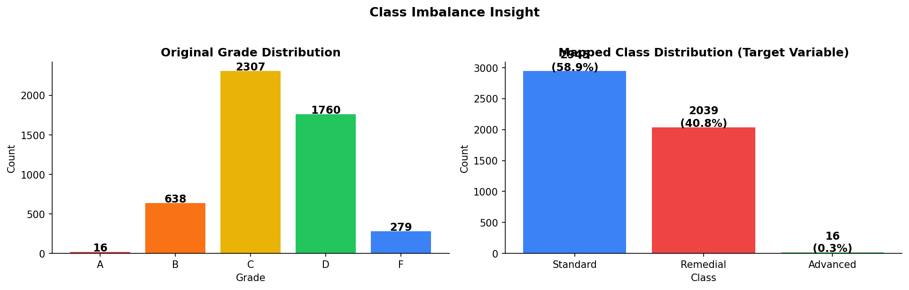
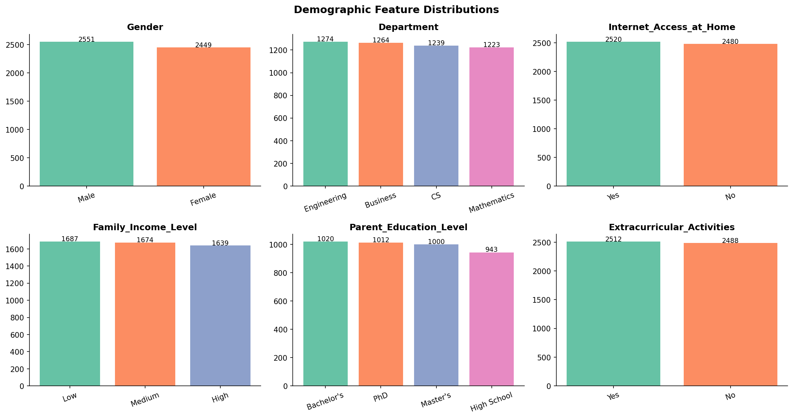
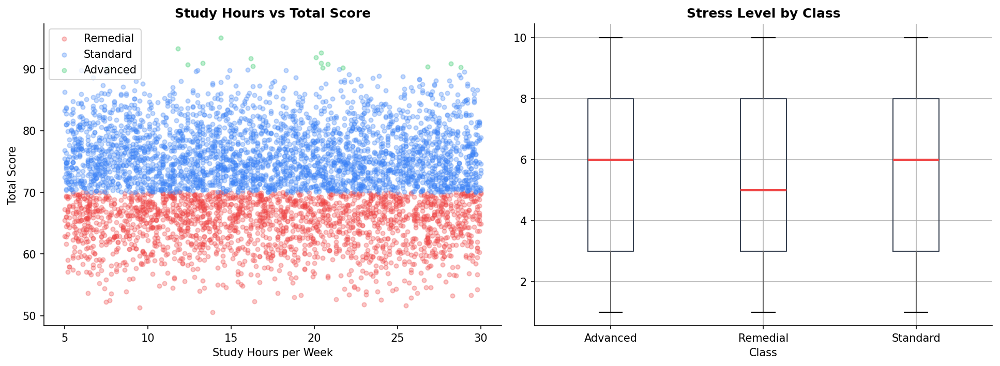
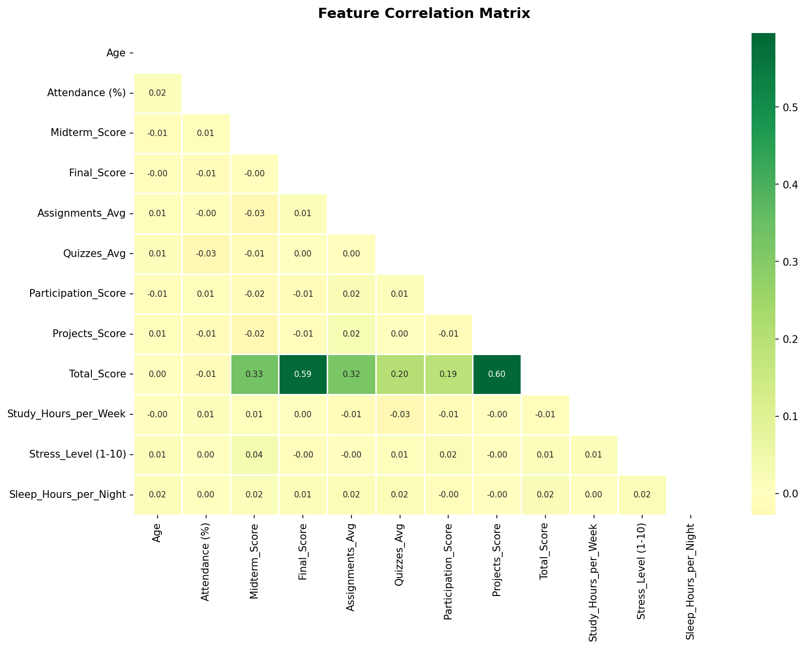
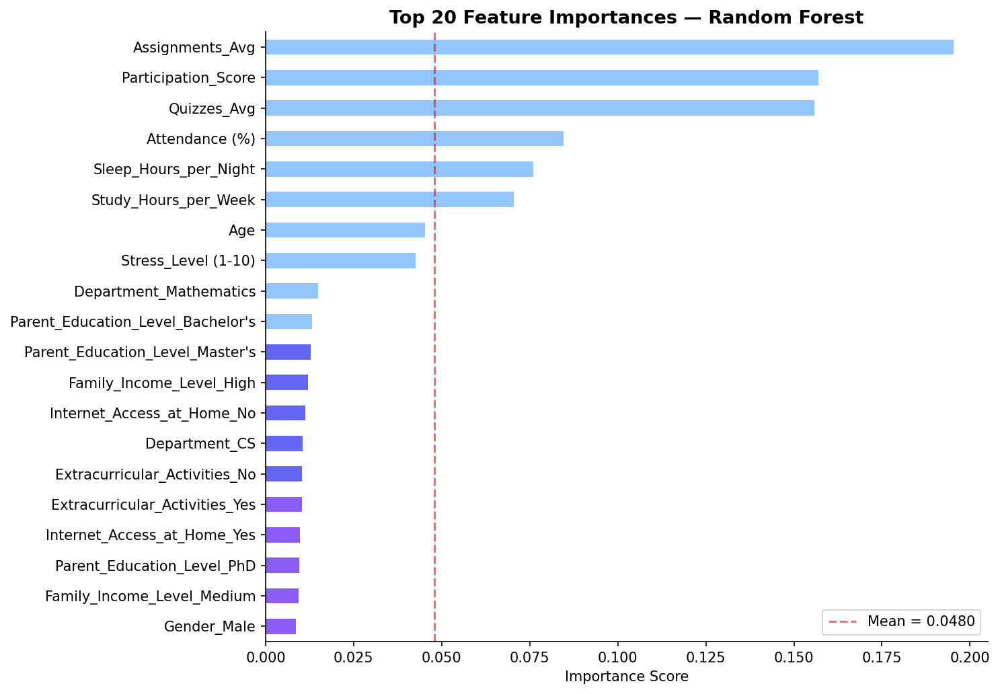
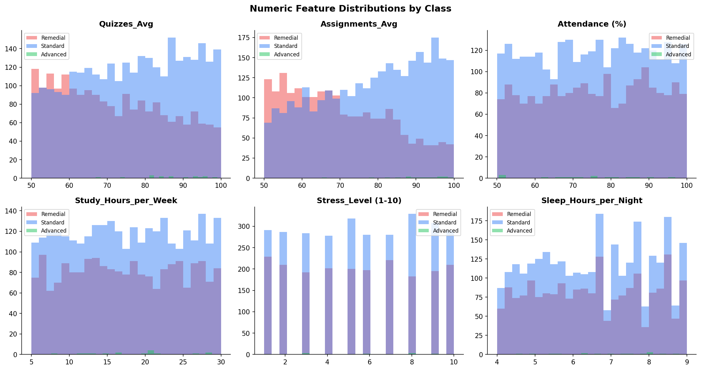
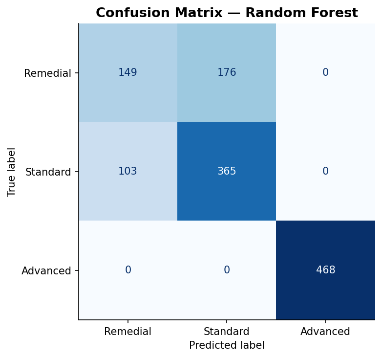
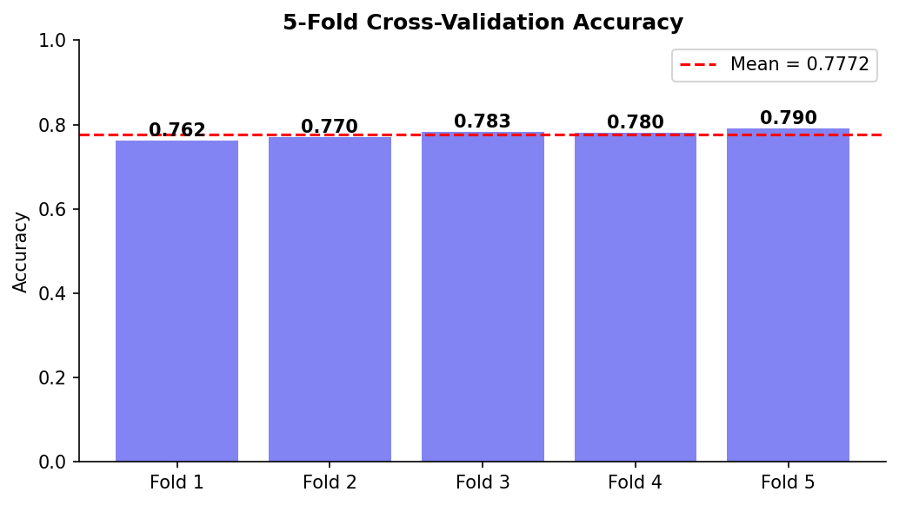

# Lumora Machine Learning Workspace

Direktori ini difokuskan untuk pemrosesan dataset, analisis data eksploratif (EDA), dan pelatihan model kecerdasan buatan untuk sistem pembelajaran adaptif. Model ini menjadi otak utama di balik fitur **Asisten Lumora AI** dan **Sistem Peringatan Dini (Early Warning System)** pada Dasbor Guru.

---

## 📂 Struktur Direktori & Aset

### 1. `data/` (Dataset)
Menyimpan dataset mentah dan data historis yang digunakan untuk melatih model:
- `Students Performance Dataset` (CSV & JSON): Dataset utama yang mencatat performa, skor kuis, absensi, hingga faktor perilaku seperti jam tidur dan tingkat stres.
- `Students_Grading_Dataset_Biased` (CSV & JSON): Dataset tambahan untuk analisis bias penilaian.
- `xAPI-Edu-Data.csv`: Dataset sekunder metrik edukasi.

### 2. `models/` (Model & Artefak Visual)
Menyimpan artefak model yang telah dilatih (`.joblib`) serta berbagai grafik hasil *Exploratory Data Analysis* (EDA):
- **Model Aktif:** `student_behavior_model.joblib` dan `student_performance_model.joblib` (Siap dipanggil oleh layanan *Backend* FastAPI).
- **Insight Visual:** Grafik-grafik PNG yang memberikan wawasan mendalam mengenai perilaku siswa (ditampilkan di bagian bawah dokumen ini).

### 3. `notebooks/` (Eksperimen Jupyter)
Menyimpan dokumen *Jupyter Notebook* untuk eksperimen, eksplorasi data mendalam, dan *tuning* parameter:
- `eda_and_modeling.ipynb`: Notebook mentah berisi alur pemrosesan dari awal hingga akhir.
- `eda_and_modeling_executed.ipynb`: Notebook yang telah dieksekusi dengan *output* sel lengkap untuk ditinjau tanpa perlu di-*run* ulang.

### 4. `src/` (Skrip Otomatisasi)
Berisi skrip utama Python:
- `train.py`: Skrip produksi untuk menjalankan proses pelatihan model (pemuatan data, prapemrosesan, hingga *export* artefak model `.joblib`).
- `eda.py`: Skrip untuk menghasilkan grafik profil data secara otomatis.

---

## 🧠 Arsitektur Model

- **Algoritma:** *Random Forest Classifier*
- **Target Prediksi:** Mengklasifikasikan tingkat risiko/performa siswa ke dalam kategori adaptif (misal: Remedial, Standard, Advanced).
- **Fitur Utama (Features):** Kategori pelajaran, rata-rata nilai kuis, tingkat penyelesaian materi, jam belajar mingguan, durasi tidur (*sleep hours*), dan tingkat stres (*stress level*).

---

## 📊 Insight Data & Exploratory Data Analysis (EDA)

Berikut adalah ringkasan visual dari hasil analisis data siswa kami yang tersimpan di dalam direktori `models/`:

### Distribusi Kelas & Demografi
Menganalisis keseimbangan data target dan sebaran demografis siswa (umur, gender, dsb).
<div style="display: flex; gap: 10px;">
  
  
</div>

### Perilaku Siswa & Korelasi Fitur
Bagaimana jam tidur, tingkat stres, dan partisipasi belajar berkorelasi terhadap performa akhir siswa.
<div style="display: flex; gap: 10px;">
  
  
</div>

### Kepentingan Fitur (Feature Importance) & Distribusi
Variabel apa saja (misal: skor kuis, kehadiran, jam tidur) yang paling kuat memengaruhi model *Random Forest* saat menentukan status siswa.
<div style="display: flex; gap: 10px;">
  
  
</div>

### Evaluasi Model (Confusion Matrix & Cross-Validation)
Validasi akurasi model dalam membedakan siswa berisiko tinggi dan siswa berprestasi.
<div style="display: flex; gap: 10px;">
  
  
</div>

---

## 🚀 Melatih Ulang Model (Retraining)

Jika terdapat data baru (seiring berjalannya aplikasi Lumora di tahap produksi), Anda dapat melatih ulang model dengan mudah menggunakan perintah berikut:

```bash
python src/train.py
```

Skrip ini akan mengeksekusi ekstraksi data terbaru, melatih ulang *Random Forest Classifier*, menimpa (*overwrite*) artefak `.joblib` di dalam folder `models/`, dan menghasilkan ulang grafik-grafik EDA terbaru di atas.
